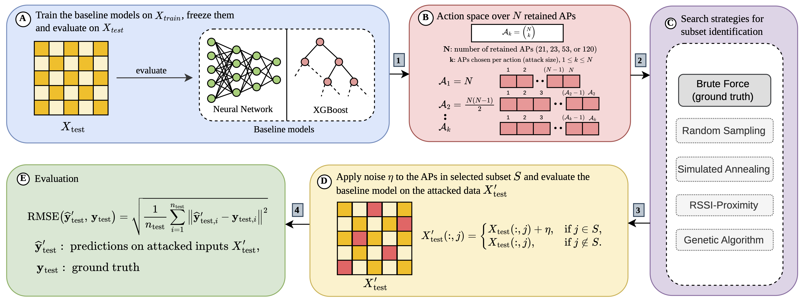

# APexDQN: Deep Q-Network–Based Access-Point Attack Optimization for Indoor Localization Security



---

## Overview

This repository provides the **official implementation** of the paper:

> **Muhammed Noshin**, **Muhammad Hannan Akhtar**, **Mohamed I. AlHajri**, **Mohammad Zulkernine**  
> *APexDQN: Deep Q-Network–Based Access-Point Attack Optimization for Indoor Localization Security*, 2025.

The project introduces **APexDQN**, a reinforcement-learning framework designed to uncover security-critical Access Point (AP) subsets that, when perturbed, cause maximum degradation in indoor localization accuracy.  
By framing AP subset selection as a one-step contextual bandit, APexDQN achieves near-exhaustive performance with a **328× (NN)** and **272× (XGBoost)** runtime reduction, offering a practical and scalable approach for vulnerability assessment in Wi-Fi-based indoor localization systems.

---

## Abstract

Wi-Fi fingerprint-based indoor localization models are widely deployed in smart buildings, industrial IoT, and navigation systems. However, their robustness to adversarial signal perturbations remains largely unexplored.  

This work introduces APexDQN, a deep Q-learning approach that efficiently identifies worst-case subsets of access points whose targeted RSSI manipulation leads to maximal localization error.  
The problem is formulated as a one-step contextual bandit, where a DQN policy learns the mapping between AP combinations and induced model degradation, bypassing the need for brute-force enumeration.  

Evaluations on the **UJIIndoorLoc** dataset using neural network and XGBoost regressors demonstrate that APexDQN achieves up to **328×** and **272×** faster identification of near-worst-case subsets, respectively, while preserving **>98–99 % fidelity** to brute-force results.  
The framework provides actionable AP vulnerability rankings to inform security-aware system design.

---

## Setup

### 1. Clone and prepare environment
```bash
git clone https://github.com/<your-username>/<repo-name>.git
cd <repo-name>
python -m venv .venv
source .venv/bin/activate        # On Windows: .venv\Scripts\activate
pip install -r requirements.txt
```

### 2. Dependencies
```
numpy, pandas, scikit-learn, tensorflow, keras, torch, xgboost, tqdm, matplotlib, joblib
```

The `data/` folder already contains the required CSV files and noise configuration used in the experiments.

---

## Running Experiments

### 1. Train Baselines
Train and evaluate the baseline models:
```bash
python -m scripts.train_baselines
```
Outputs MSE and MAE for neural network, linear, and XGBoost regressors.

---

### 2. Brute-Force Evaluation
Enumerate all possible AP subsets of size *k = 1 … 21* and measure degradation:
```bash
python -m scripts.run_bruteforce --backend xgb
```
Results are saved in:
```
results/experiment_progress_21APs_unified.txt
```

---

### 3. APexDQN Training
Train the DQN-based policy for efficient AP subset discovery:
```bash
python -m scripts.train_apexdqn --backend xgb --episodes 100
```
Outputs:
```
results/apexdqn_results.txt
```
Each line logs:
```
k, "Best_AP_Combination", Best_MSE, Time_sec
```

---

## Methodology Summary

### Brute-Force Search
Exhaustively evaluates every AP subset under additive noise.
This provides the ground-truth vulnerability distribution, serving as the benchmark for APexDQN.

### APexDQN (Proposed)
- Models AP subset selection as a one-step contextual bandit.  
- Employs a DQN agent with ε-greedy exploration.
- Reward is defined as the increase in localization MSE after perturbing the chosen subset.  
- Each episode is terminal; training is purely single-step, requiring no replay buffer or target network.  
- This reduces the search complexity from combinatorial, $\mathcal{O}\left(\binom{N_{AP}}{k}\right)$, to linear in the number of episodes.

---

## Experimental Results

| Model | Max Error Increase | Percentile Fidelity | Runtime Reduction |
|:------|:-------------------|:--------------------|:------------------|
| Neural Network | +115 % (k = 14) | 99th percentile | ≈ 328 × |
| XGBoost | +82 % | 98th percentile | ≈ 272 × |

APexDQN successfully identifies the most security-critical APs within the top 1–2 % of the brute-force distribution while drastically reducing runtime and computation.

---

## Key Contributions

- Reformulates AP subset attacks as a reinforcement-learning optimization problem.  
- Introduces APexDQN, a deep Q-network capable of approximating worst-case AP combinations without exhaustive search.  
- Demonstrates cross-model robustness on both NN and XGBoost localizers using UJIIndoorLoc.  
- Provides a scalable vulnerability assessment tool for secure indoor localization systems.

---

## Citation (To be changed after publication)

If you use this code, please cite:

```bibtex
@article{APexDQN2025,
  author  = {Muhammed Noshin and Muhammad Hannan Akhtar and Mohamed I. AlHajri and Mohammad Zulkernine},
  title   = {APexDQN: Deep Q-Network-Based Access-Point Attack Optimization for Indoor Localization Security},
  year    = {2025},
  note    = {Official implementation}
}
```

---

## Authors and Affiliations

**Muhammed Noshin**, **Muhammad Hannan Akhtar**, **Mohamed I. AlHajri**, **Mohammad Zulkernine**  
- *Department of Computer Science and Engineering*, American University of Sharjah, UAE  
- *School of Computing*, Queen’s University, Canada

---

## License

Released under the **MIT License**.  
You are free to use, modify, and distribute this code with proper attribution.

---
